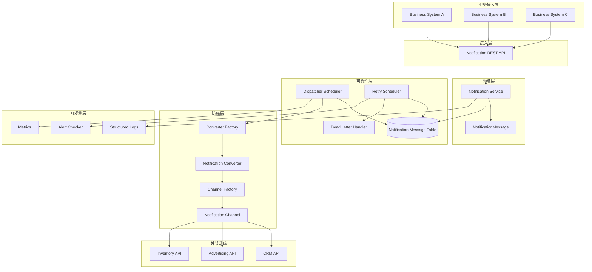
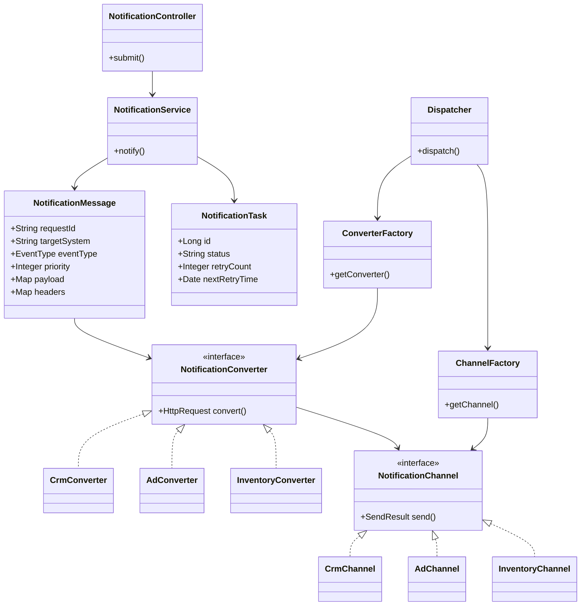
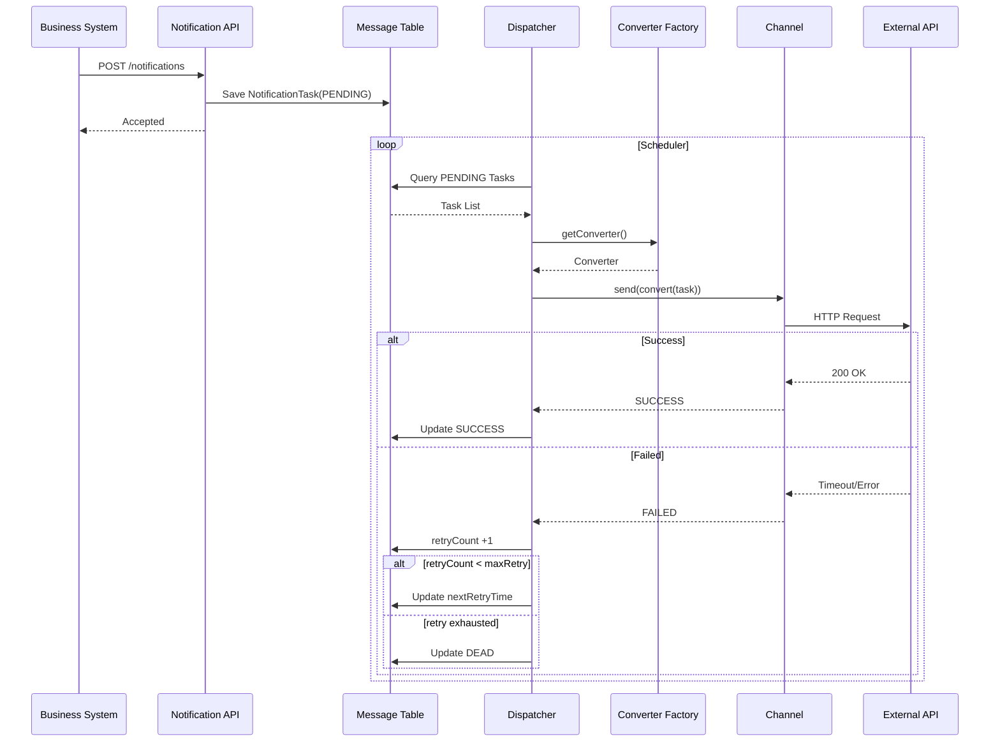

### 问题回答

#### 1. 系统边界

**Q：哪些问题你选择在这个系统中解决？**

- **统一通知入口**：业务系统只调 `notificationService.notify()` / `POST /api/v1/notifications`，不直连第三方。
- **协议隔离**：通过防腐层（ACL）将 `NotificationMessage` 转为各供应商的 HTTP 请求，第三方协议不侵入业务。
- **可靠投递**：先落库再异步发送，服务异常不丢消息。
- **自动重试 + 死信**：失败按指数退避重试，耗尽后进 `DEAD`，支持人工补偿。
- **幂等控制**：`requestId` + 唯一索引，避免重复提交。
- **基础可观测**：结构化日志 + 核心指标/告警，及时发现失败、积压与供应商异常。

**Q：哪些问题你明确选择不解决？为什么？**

| 不解决 | 原因 |
|--------|------|
| 业务事务一致性（如支付成功但通知 CRM 失败不回滚） | 定位为集成基础设施，不是分布式事务协调器 |
| Exactly Once | 网络超时无法判断第三方是否已处理；采用 At Least Once，要求第三方接口幂等 |
| 第三方业务语义（CRM 状态非法、库存不足等） | 只负责送达，不校验对方业务规则 |
| MVP 复杂优先级调度（优先级队列、流控、多级调度） | 先验证可靠投递；`priority` 字段预留 |
| MVP 动态模板（Freemarker / Velocity） | 系统间集成为主，payload 为结构化 JSON，引入模板属过度设计 |
| MVP 消息队列 | 最简实现：HTTP 接入 + 数据库作本地消息表 |

---

#### 2. 可靠性与失败处理

**Q：你选择的通知投递语义是什么？**

**At Least Once（至少一次）**。实现路径：业务请求 → 消息落库 → 异步发送 → 失败重试 → 死信。

**Q：在外部系统失败或长期不可用的情况下，你的处理策略是什么？**

1. **持久化优先**：请求先写入 `NotificationTask`（`PENDING`），再异步投递，避免进程崩溃丢消息。
2. **自动重试**：发送失败递增 `retryCount`，按指数退避调度下次重试：`1 min → 5 min → 30 min → 1 h → 6 h`。
3. **死信兜底**：达到最大重试次数后状态流转 `PENDING → FAILED → DEAD`，转人工补偿，避免无限重试拖垮系统。
4. **可观测介入**：监控失败率、重试次数、积压量、死信数量；超阈值告警，便于运维介入或联系供应商。
5. **不阻塞业务**：接入层快速返回 `Accepted`；外部长期不可用不影响业务主流程，消息在库中等待恢复后继续投递。

---

#### 3. 取舍与演进

**Q：在 AI 的方案建议中，你认为哪些设计是"过度的"，并选择不采纳？**

- **消息队列（Kafka 等）**：MVP 用 DB 本地消息表即可满足可靠投递，引入 MQ 增加运维与一致性复杂度。
- **完整可观测与告警体系**：成功率、失败率、积压、死信等全量指标 + 阈值告警对 MVP 偏重；保留结构化日志与基础告警即可。
- **优先级队列 / 动态流控 / 多级调度**：当前流量下无刚需，`priority` 字段预留，调度逻辑后续再加。
- **动态模板引擎**：通知 payload 为结构化数据，无需 Freemarker / Velocity。

**Q：如果这是第一版系统，未来流量或复杂度显著增长时，你会如何演进？**

| 阶段 | 演进方向 |
|------|----------|
| 接入层 | 提供 Java / Go 轻量 SDK（内部仍走 HTTP）；大规模场景改为 **rocketmq 事件驱动**（`Business → rocketmq → Notification Gateway`），降低耦合 |
| 可靠性 | 引入 MQ 削峰填谷；多实例 Dispatcher 加分布式锁/分片消费，提升吞吐 |
| 调度 | 基于 `priority` 实现优先级队列；按供应商 SLA 做动态流控与隔离 |
| 可观测 | 补齐 Prometheus 指标、链路追踪、分级告警与死信自动回放 |
| 扩展性 | Converter / Channel 工厂模式已预留，新增供应商只需实现对应 Converter + Channel |

---

## 1. 项目背景

企业内部多个业务系统在关键事件发生时，需要调用外部系统供应商提供的 HTTP(S)
API 进行通知。例如：

- 用户通过第三方广告系统引流并成功注册后，通知对应的广告系统
- 用户订阅付款成功后，通知 CRM 系统更改 Contact 状态
- 用户购买商品后，通知库存系统进行库存变更

不同供应商的 API：

- 请求地址不同
- Header / Body 格式不同

业务系统本身：

- 不需要关心外部 API 的返回值
- 只需确保通知请求能够被稳定、可靠地送达


## 2. 需求分析

需求重点：

### 2.1 统一通知入口

业务系统无需关心第三方系统的协议细节。

统一调用：

```
notificationService.notify(message);
```

即可完成通知提交。

### 2.2 屏蔽第三方系统差异

通过防腐层（ACL）隔离业务模型与第三方模型：

```
业务模型
    ↓
NotificationMessage
    ↓
Converter
    ↓
Vendor Request
```

避免第三方协议侵入业务系统。

### 2.3 提供可靠投递能力

业务系统不关心通知结果。

通知系统需要保证：

- 消息不丢失
- 自动重试
- 最终尽可能送达

系统采用：

> At Least Once（至少一次）

投递语义。

### 2.4 提供基础可观测能力

系统需要能够发现：

- 大量通知失败
- 消息积压
- 外部供应商异常
- 长时间未送达

## 3. 功能拆分

### 3.1 统一通知接入

提供统一 HTTP API：

```
POST /api/v1/notifications
```

接收业务系统提交的通知请求。

### 3.2 消息持久化

所有通知请求首先写入数据库。

避免服务异常导致消息丢失。

### 3.3 异步投递

通知提交成功后异步发送。

避免业务线程阻塞。

### 3.4 渠道抽象

对外部供应商进行统一抽象：

```
interface NotificationChannel {

    SendResult send(HttpRequest request);

}
```

新增供应商时无需修改核心流程。

### 3.5 协议转换（防腐层）

统一领域模型：

```
NotificationMessage
```

转换为：

```
CRM Request
AD Request
Inventory Request
```

通过 Converter 实现：

```
interface NotificationConverter {

    HttpRequest convert(NotificationMessage message);

}
```

### 3.6 重试机制

发送失败时自动重试。

采用指数退避：

```
1 min
5 min
30 min
1 hour
6 hour
```

### 3.7 死信处理

达到最大重试次数后：

```
PENDING
 ↓
FAILED
 ↓
DEAD
```

进入死信状态。

支持人工补偿。

### 3.8 幂等控制

每条通知携带：

```
requestId
```

数据库建立唯一索引：

```
unique(request_id)
```

避免重复提交。

### 3.9 可观测与告警（过度设计）

提供：

- 发送成功率
- 失败率
- 重试次数
- 消息积压
- 死信数量

并基于阈值触发告警。

## 4. 系统架构

### 架构层级图




### 类图



### 时序图




## 5. 核心对象

消息对象：

```
public class NotificationMessage {

    private String requestId;

    private String targetSystem;

    private EventType eventType;

    private Integer priority;

    private Map<String, Object> payload;

    private Map<String, String> headers;
}
```

其中：

- 元数据统一标准化
- payload 保持业务灵活性

通知系统不约束 payload 的具体结构。

## 6. 系统边界

### 6.1 系统负责解决的问题

#### 统一通知入口

业务系统仅调用通知服务，不直接访问第三方系统。

#### 第三方协议隔离

通过防腐层隔离第三方协议。

#### 可靠投递

保证通知消息不会因为服务异常而丢失。

#### 自动重试

发送失败自动重试。

#### 幂等控制

避免重复通知。

#### 基础告警能力

发现异常及时通知运维人员。

## 6.2 明确不解决的问题

### 不保证业务事务一致性

例如：

```
支付成功
↓
通知 CRM 失败
```

支付状态不会回滚。

原因：

通知系统定位为集成基础设施，而非分布式事务协调器。

### 不保证 Exactly Once

系统仅保证：

> At Least Once

原因：

网络超时场景下无法准确判断第三方是否已成功处理请求。

因此要求：

第三方接口具备幂等能力。

### 不解决第三方业务语义问题

例如：

```
CRM 状态非法
库存不足
```

属于第三方业务逻辑问题。

通知系统仅负责消息送达。

### MVP 不实现复杂优先级调度

系统保留：

```
priority
```

字段。

但暂不实现：

- 优先级队列
- 动态流控
- 多级调度

原因：

当前目标是验证可靠投递能力。

复杂调度机制属于后续演进方向。

### MVP 不实现动态模板系统

通知系统主要解决系统间集成问题。

消息以结构化数据为主：

```
{
  "userId":"1001",
  "status":"PAID"
}
```

因此暂不引入：

- Freemarker
- Velocity

避免过度设计。

### MVP不使用消息队列

mvp版本考虑最简实现，使用http接受请求，使用数据库存储待投递消息。

## 7. 可靠性设计

系统采用：

> At Least Once

可靠投递语义。

实现方式：

```
业务请求
    ↓
消息落库
    ↓
异步发送
    ↓
失败重试
    ↓
死信
```

核心设计：

- 本地消息表
- 唯一 requestId
- 自动重试
- 死信机制

## 9.对外服务暴露方式

MVP阶段，通知系统采用 HTTP API 作为统一接入协议。

```
POST /api/v1/notifications
```

选择 HTTP 的原因：

1. 语言无关，业务系统无需依赖特定 SDK。
2. 接入成本低，任何支持 HTTP 的系统均可快速接入。
3. 易于统一实现认证、审计、限流与监控。
4. 符合当前微服务体系下基础设施组件的通用实践。

系统未来可提供轻量级 SDK（Java/Go）作为便利层，简化业务接入，但 SDK 内部仍然通过 HTTP 调用通知服务。

对于更大规模的场景，系统未来可进一步演进为事件驱动模式：

```
Business System
        ↓
      Kafka
        ↓
Notification Gateway
```

通过消费业务事件完成通知投递，以进一步降低业务系统与通知系统之间的耦合。